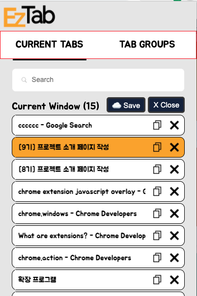
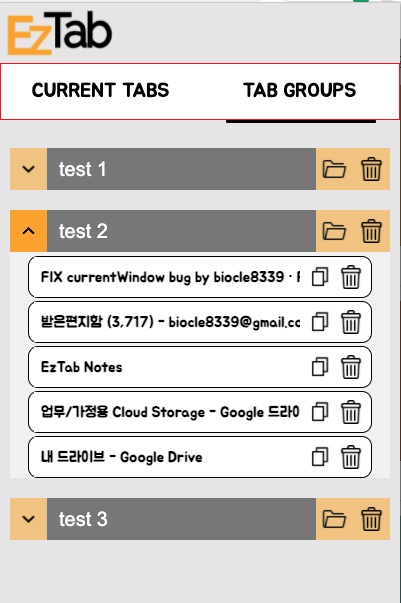

# 목차
  - [EzTab이란?](#eztab이란)
    * [발표 링크](#발표-링크)
  - [EzTab의 주요 유저층](#eztab의-주요-유저층)
  - [EzTab을 만들게 된 동기](#eztab을-만들게-된-동기)
  - [EzTab이 사용자 경험에 기여한 점](#eztab이-사용자-경험에-기여한-점)
  - [개발 과정](#개발-과정)
    + [Tech Stack](#tech-stack)
    + [개발 이슈](#개발-이슈)
  - [마지막으로...](#마지막으로)

# EzTab이란?

- 브라우저 사용시 탭이 많이 켜져있을 때도 유저가 원하는 탭을 빠르게 찾을 수 있게 도와주는 플러그인입니다.
- 현재 사용하지 않는 탭은 메타데이터만 저장함으로써 컴퓨터 자원을 아낄 수 있게 도와주는 플러그인입니다.

# 발표 링크

# EzTab의 주요 유저층

업무를 할 때 웹 브라우저 탭을 많이 키는걸 선호하는 유저들을 위해서 만들었습니다.

# EzTab을 만들게 된 동기

프로그래밍할 때 찾고 찾고 찾다보면 탭이 백개가 넘고 윈도우가 네댓개가 넘어갈 때가 있었는데

그럴 때 컴퓨터 성능저하도 무척 답답하고 껐다가 다시 원할 때 언제든지 어떤 컴퓨터에서든 쓰고 싶어서 만들게 되었습니다.

아무래도 크롬 익스텐션이다보니 누구든지 가볍게 사용이 가능하며 용량도 적어야한다고 생각하여 심플한 UI와 VanillaJS를 사용하게 되엇습니다.

# EzTab이 사용자 경험에 기여한 점

1. 크롬 같은 경우 탭을 많이 킬 수록 사이트의 제목이 안보여서 원하는 탭을 찾기 위해서는 위치를 외우고 있지않는 이상 클릭해야하는 번거로움이 있었습니다. 이 과정때문에 찾는 시간이 평균 7초 정도 걸리지만 EzTab을 이용하면 플러그인에서 바로 검색하면 되므로 평균 3초 정도 걸리게 됬습니다.
2. 탭을 많이 사용하게 되면 메모리 사용량이 점점 늘어나서 컴퓨터 속도에 영향을 끼치게됩니다. 하지만 EzTab을 이용하게되면 켜놨던 탭들을 저장함으로써 메모리 사용량을 줄여주게됩니다. 40개의 탭을 사용하고있다가 그중 27개의 탭을 저장했을 시 메모리 사용량이 871mb에서 216mb로 줄어들었습니다.

# 개발 과정

  [Roadmap](https://www.notion.so/3332e5e6df834126abcac61d26b1a1dc)

  [Note](https://www.notion.so/b7613b3688384c6fb4f550666adba90e)

### Tech Stack

- Language
    - Javascript
- Libraries
    - Chrome API - to get tab information
    - Lodash - for debounce
- Bundler
    - Webpack - to prevent the collision between variables or modules

## 개발 이슈

1. 코드 디자인

    처음에 구상하기 시작하는 단계에서는 vanillaJS로 구현을 하더라도 이미 존재하는 디자인 패턴에서 그대로 차용해서 가져오면된다고 간단하게 생각하였었습니다.
    그렇게 짜기 시작했던 첫번째 코드가 컴퍼넌트 스타일로 구현한 모델이었습니다.

    하지만 어느정도 구조를 완성하고 짜다보니 본질적인 의문에 도달했습니다.

    이렇게 만들어진 구조가 지금 **내가 만들려고하는 앱에 필요한 이유가 있는가?**라는 의문이었습니다. 제가 필요한 기능을 넣은 구조가 아니라 그저 리액트가 익숙하다해서 따라한 구조라는 생각이 들어서 코드 구조를 전반적으로 바꾸기로 결정했습니다.

    **단순히 익숙한 구조를 적용하는게 아닌 왜 이 패턴이 나에게 필요한지에 대한 장단점을 비교해보고 결정해야한다는 것을 느꼈습니다.**

    그래서 가장 기본적인 mvc 모델을 차용하여 거기에서 필요할 때 더 추가하는 식으로 구성하였습니다.

    **여기서 느꼈던 점이 유명 라이브러리나 프레임워크를 그저 따라하는 것이 아닌 내가 필요한 기능이 있을 때 적재적소에 사용할 수 있어야한다는 것입니다.**

2. 변화하는 생태계

    제가 개발을 하던 도중에는 chrome extension manifest v2→ v3로 변경되는 와중이라 몇몇 기능들이 사용이 안되는데 chrome api document에는 안적혀있는 문제가 있었습니다. 또한 기능따라 promise 지원 여부가 달라서 예상치 못한 버그가 종종 발생하였습니다. chrome api 개발 환경이 실시간으로 바뀌는 걸 볼 수 있는 좋은 경험이었습니다.

# 마지막으로...

이번이 처음으로 제가 혼자서 다하는 프로젝트였었습니다. 아무래도 혼자 하는데 새로운 크롬 익스텐션에 도전을 하다보니 더더욱 막막했던 거 같습니다. 물론 혼자하면서 배웠던 점도 많지만 이 과정에서 팀원들이 있었으면 더 다양한 시각에서 소통하며 아이디어, 기획부터 결과를 만들어내기까지 더 완성도를 높게 잡을 수 있었지않을까싶습니다.

하지만 혼자 구조를 짜면서 엎고 다시 만들기도 하고 시행착오를 여럿 겪으면서 자바스크립트 기초를 다시 다질 수 있는 좋은 기회였다고 생각합니다. 분명 배웠지만 기억이 안나던 것도 있었고 이론으로만 알고있던걸 손으로 직접 써보는 계기도 되서 정말 좋았습니다.
